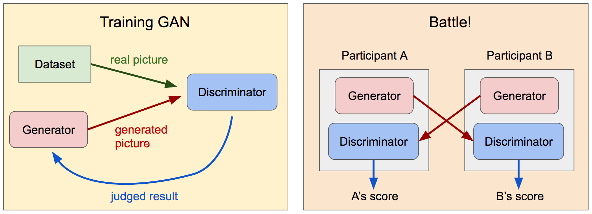
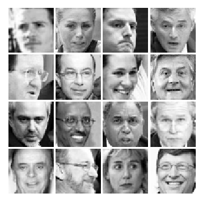
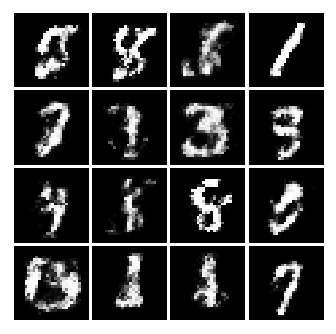

Table of Contents
=================

   * [Table of Contents](#table-of-contents)
   * [Generative Adversarial Networks](#generative-adversarial-networks)
      * [Objectives](#objectives)
         * [Battle Rules](#battle-rules)
      * [Input Data Format](#input-data-format)
      * [What you need to do](#what-you-need-to-do)
      * [Spec](#spec)
      * [Running Code in Google Cloud](#running-code-in-google-cloud)
         * [Training in Cloud](#training-in-cloud)
         * [Evaluating the Model in Cloud](#evaluating-the-model-in-cloud)
      * [Running Code Locally](#running-code-locally)
         * [Training Locally](#training-locally)
         * [Evaluation Using Validation](#evaluation-using-validation)
         * [Training Locally with MNIST](#training-locally-with-mnist)
      * [Submission](#submission)
 
# Generative Adversarial Networks
In this problem, you will attempt to train [GAN (Generative Adversarial Networks)](https://arxiv.org/abs/1701.00160).
GAN consists of two networks - Generator and Discriminator. With given dataset of human face pictures, you will be asked to train those two networks.

- Generator : generates an image similar to the human face photos from given dataset.
- Discriminator : judges an image whether it is a generated one or a real one from given dataset.

After the training phase, you will battle with other participants, with your 2 models!

## Objectives
Below is the brief workflow.

- Training phase : you have to train your generator / discriminator models using skeleton code and Google Cloud platform if needed
- Battle phase : based on submitted models, we will process each battle and show you the result.

### Battle Rules
We will hold a single-elimination tournament for 16 teams. Battles will be processed by us based on your submitted models in Google Cloud, and the result will be shown in the front screen.

Let's say team A and team B battle each other.
1. A's generator generates 15 images, and mix with 15 real images from the test dataset.
2. B's discriminator sees the list of 30 images from A, and makes predictions.
3. Comparing with ground truth, the number of correct prediction will be a B's score.
4. After then, change the roles - now B's generator and A's discriminator do the same thing (step 1 to 3).
5. Compare A's score and B's score, and decide a winner of current round.
6. Doing step 1 to 5 is one round. We will have total 1 round for each battle until semi-final, and for final we will have total 3 rounds.
7. After finishing all rounds, decide a winner. If score is tied, the team who has less total running time (running generator/discriminator) wins.


## Input Data Format
Each human face image in the dataset is downsampled to 50x50 size and also converted to grayscale. The data is from [labeled faces in the wild](http://vis-www.cs.umass.edu/lfw/).
Here are some samples :




All the data are available on Google Cloud, in following addresses :
- Training data: gs://kmlc_test_train_bucket/gan/train.tfrecords (11901 images)
- Validation data: gs://kmlc_test_train_bucket/gan/validation.tfrecords (689 images)

Most likely you want to train your model in Google Cloud, but validation data is small enough that you may also want to run them locally.

You can download all data using :
```
gsutil cp -r gs://kmlc_test_train_bucket/gan/train.tfrecords ./
gsutil cp -r gs://kmlc_test_train_bucket/gan/validation.tfrecords ./
```

Training data and cross validation data share the same format, where each records consists of only one feature:
- image_raw: a int64 list feature that stores the value of each pixel (0 to 255). It's a one-dimensional list of flattened 50x50 image.

Test data (which has 624 images) will not be provided, since it will be used for battle after training.


Also, MNIST data is available on Google Cloud in the same place with [MNIST tutorial](https://github.com/machine-learning-challenge/tutorial_mnist/tree/master/mnist) we provided. The source code supports to test with MNIST, to help validating your model and training logic. See [Training Locally with MNIST](#training-locally-with-mnist) for testing your model with MNIST dataset.
```
gsutil cp -r gs://kmlc_test_train_bucket/mnist ./
```

## What you need to do
* This repository provides a skeleton code which implements very basic structure of GAN. If you run train.py directly without any modification on this repository, generated images after training will be like this (a bit scary though) :


* You have to modify some part of code to improve this model.
* Create your own models (generator, discriminator) which extends BaseModel in *models.py*. You can also modify BaseModel as you wish.
* Create your own class which extends BaseLoss and implements calculate_loss in *losses.py*, which fits with your models.
* Adjust the training logic in *train.py*, if needed.
* IMPORTANT - If you need any preprocessing/resizing on data, please do it in *models.py*, not in *readers.py*. We will run your trained models based on the checkpoint files, and the shape of input tensor should be matched with the spec.


## Spec
* In battle, we will use your trained model from the checkpoint file (saved by tf.train.Saver) in the Google Cloud bucket. Each team will have unique bucket for submitting. See [Submission](#submission) part for details.
  * Note that the logic of saving model is already implemented in the skeleton code, so don't worry.
* For generating various images, generator model should use the predefined random noise signal as its input (also called "latent vector"). 
  * *random_noise_generator.py* will be used as the input of generator model, for consistency.
  * It has 100 float numbers which are randomly generated by uniform random between [-1, 1].
* For simplicity, both generator and discriminator should be in the same checkpoint file. The default graph in the checkpoint file should contain all of following tensors as collections added by tf.add_to_collection(), with correct collection name :
  * **"noise_input_placeholder"** : placeholder tensor with *[None, 100]* shape, which is for putting the noise input (latent vector) to generator model. Again, *random_noise_generator.py* will be used for this input.
  * **"generated_images"** : tensor with *[None, 2500]* shape, which will hold the generated 50x50 images from generator model, with flattened shape. The value of each pixel should be a float between [0, 1], where 0 represents black and 1 indicates white.
  * **"input_batch_raw"** : placeholder tensor with *[None, 2500]* shape, which is for putting the flattened 50x50 image data to discriminator model as an input. The value of each pixel should be a float between [0, 1], where 0 represents black and 1 indicates white.
  * **"p_for_data"** : tensor with *[None, 1]* shape, which will hold the prediction results of "input_batch_raw", computed by discriminator model. Each prediction value is a float between [0, 1] range - 0 means fake image and 1 means real image.
  * Note that the skeleton code already meets those spec.
* DO NOT make generator just memorizing the image from training data and outputting one of them - we can examine it on submitted models.
* Also for fairness, DO NOT make discriminator that doesn't use the training logic of GAN - e.g. separately trained SVM discriminator (without using generator) is prohibited.
* It is prohibited to use external data.

## Running Code in Google Cloud
Consider the size of training data, most likely you want to train in Google Cloud. Replace --generator_model and --discriminator_model with your model name and modify the directory paths accordingly.

All gcloud commands should be done from the directory *immediately above* the source code. You should be able to see the source code directory if you run 'ls'.

### Training in Cloud
```
BUCKET_NAME=gs://${USER}_kmlc_gan_train_bucket
# (One Time) Create a storage bucket to store training logs and checkpoints.
gsutil mb -l us-east1 $BUCKET_NAME
# Submit the training job.
JOB_NAME=kmlc_gan_train_$(date +%Y%m%d_%H%M%S); gcloud --verbosity=debug ml-engine jobs \
submit training $JOB_NAME \
--package-path=gan --module-name=gan.train \
--staging-bucket=$BUCKET_NAME --region=us-east1 \
--config=gan/cloudml-gpu.yaml \
-- --train_data_pattern='gs://kmlc_test_train_bucket/gan/train.tfrecords' \
--generator_model=SampleGenerator --discriminator_model=SampleDiscriminator \
--train_dir=$BUCKET_NAME/kmlc_gan_train --num_epochs=50 --start_new_model
```

You can use tensorboard to check the performance visually. Change the value of --export_model_steps flag in train.py to adjust the period of leaving summaries to tensorboard.
```
tensorboard --logdir=$BUCKET_NAME/kmlc_gan_train --port=8080
```

### Evaluating the Model in Cloud
```
JOB_TO_EVAL=kmlc_gan_train
JOB_NAME=kmlc_gan_eval_$(date +%Y%m%d_%H%M%S); gcloud --verbosity=debug ml-engine jobs \
submit training $JOB_NAME \
--package-path=gan --module-name=gan.eval \
--staging-bucket=$BUCKET_NAME --region=us-east1 \
--config=gan/cloudml-gpu.yaml \
-- --eval_data_pattern='gs://kmlc_test_train_bucket/gan/validation.tfrecords' \
--generator_model=SampleGenerator --discriminator_model=SampleDiscriminator \
--train_dir=$BUCKET_NAME/${JOB_TO_EVAL} --run_once=True
```

## Running Code Locally

As you are developing your own models, you will want to test them quickly to flush out simple problems without having to submit them to the cloud.

All gcloud commands should be done from the directory *immediately above* the source code. You should be able to see the source code directory if you run 'ls'.

### Training Locally
```
gcloud ml-engine local train --package-path=gan --module-name=gan.train -- \
--train_data_pattern='TRAINING_DATA_FILE' \
--generator_model=SampleGenerator --discriminator_model=SampleDiscriminator \
--train_dir=/tmp/kmlc_gan_train --num_epochs=50 --start_new_model
```

### Evaluation Using Validation
You can evaluate and test your model using the cross validation data.
```
gcloud ml-engine local train --package-path=gan --module-name=gan.eval -- \
--eval_data_pattern='VALIDATION_DATA_FILE' \
--generator_model=SampleGenerator --discriminator_model=SampleDiscriminator \
--train_dir=/tmp/kmlc_gan_train --run_once
```

### Training Locally with MNIST
You can also use MNIST data as a simple test whether your model's training logic is valid. 
Adding --use_mnist=True will change the reader accordingly, and also adding --export_generated_images=True will export samples of generated images as png file in 'out/' directory (it requires installing [matplotlib](https://matplotlib.org)). 

```
python train.py --train_data_pattern='MNIST_TRAINING_DATA_FILE' \
--train_dir=/tmp/kmlc_gan_train_mnist --export_generated_images=True --use_mnist=True \
--generator_model=SampleGenerator --discriminator_model=SampleDiscriminator --start_new_model 
```
Here is the sample of generated MNIST images using the skeleton code without any modification :




## Submission
We will provide a unique Google Cloud bucket for each team, starts with "gs://...".
  * You should move the checkpoint files that contains trained models into **"gs://[BUCKET NAME]/model"** directory, using "gsutil cp" command. Or, you can train your models using that place directly.
  * Also you have to submit your whole source code to **"gs://[BUCKET NAME]/source"** directory, using "gsutil cp" command.

To check your submission is valid and the checkpoint meets the [Spec](#spec), you can run *generate_and_discriminate.py* with setting both --G_train_dir and --D_train_dir with your team's bucket address, like following command :

```
BUCKET_NAME=gs://[TEAM BUCKET ADDRESS]
JOB_NAME=kmlc_gan_check_submission_$(date +%Y%m%d_%H%M%S); gcloud --verbosity=debug ml-engine jobs \
submit training $JOB_NAME \
--package-path=gan --module-name=gan.generate_and_discriminate \
--staging-bucket=$BUCKET_NAME --region=us-east1 \
--config=gan/cloudml-gpu.yaml \
-- --G_train_dir=$BUCKET_NAME/model --D_train_dir=$BUCKET_NAME/model \
--input_data_pattern='gs://kmlc_test_train_bucket/gan/validation.tfrecords' \
--num_generate=50 --output_dir=$BUCKET_NAME/results/
```
This will output the results (images, ground_truth.csv, predictions.csv) into results/ directory in the bucket. If you can see those outputs without any error, your submission is valid.
Note that we will use this script to process all battles, so please make sure that this script works for your submitted models.

### Mock Battles
We're going to have mock battles during training phase.
Team who want to test the model, submit the checkpoint files to "gs://[BUCKET NAME]/model". We will process the battle and let you know the result. We will start the first mock battle at 12:00, and every 2 hours after then.
